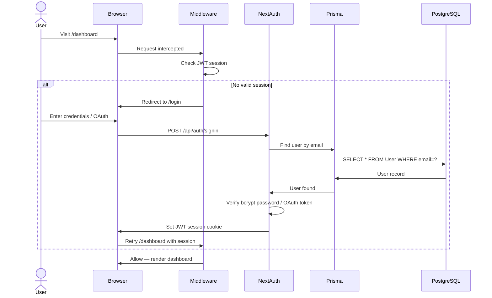

# 🌍 Traveloop

> **Personalized Travel Planning, Made Cinematic.**  
> Plan multi-city trips, manage budgets, discover activities, 
> and share your journey — all in one beautiful platform.


---

## 🎬 Demo & Links

| | Link |
|---|---|
| 🎥 YouTube Demo | [Watch Demo](https://youtube.com/placeholder) |
| 🌐 Live Frontend | [traveloop-dun.vercel.app](https://traveloop-dun.vercel.app) |
| 🔧 Backend API | [traveloop-dun.vercel.app/api](https://traveloop-dun.vercel.app/api) |

---

## 👥 Team — Syntax Sorcery

| Role | Name |
|---|---|
| 👑 Team Lead | **Aditya Raulji** |
| 🧑‍💻 Developer | Ridham Patel |
| 🧑‍💻 Developer | Rijansh Patoliya |
| 🧑‍💻 Developer | Yasar Khan |

---

## 🗺️ Architecture

```mermaid
graph TB
    subgraph "Frontend — Next.js 16 App Router"
        LP[Landing Page /]
        AUTH[Auth: /login /register /forgot-password]
        DASH[Dashboard /dashboard]
        TRIPS[My Trips /trips]
        TRIP_NEW[Create Trip /trips/new]
        TRIP_DET[Trip Details /trips/[id]]
        TRIP_BUILD[Itinerary Builder /trips/[id]/build]
        TRIP_EDIT[Edit Trip /trips/[id]/edit]
        EXPLORE[Explore /explore]
        COMMUNITY[Community /community]
        PROFILE[Profile /profile]
        ADMIN[Admin /admin]
        SHARE[Public Share /trips/[id]/share]
    end
    
    subgraph "API Layer — Next.js Route Handlers"
        API_AUTH[Auth: register, change-password]
        API_TRIPS[Trips: CRUD, Export]
        API_STOPS[Stops & Activities]
        API_BUDGET[Expenses & Budget]
        API_CHECK[Checklist]
        API_NOTES[Notes]
        API_EXPLORE[Cities & Global Activities]
        API_COMM[Community: Posts & Likes]
        API_USER[User Profile]
        API_ADMIN[Admin Stats]
    end
    
    subgraph "Database — PostgreSQL via Supabase"
        USER[User]
        TRIP[Trip]
        STOP[TripStop]
        ACT[Activity]
        SA[StopActivity]
        EXP[Expense]
        CHECK[PackingChecklist]
        NOTE[TripNote]
        POST[CommunityPost]
        BUDGET[Budget]
    end
    
    subgraph "External Services"
        SUPA[Supabase: DB & Auth Provider]
        GOOGLE[Google Auth]
        PDF[@react-pdf/renderer]
    end
    
    LP --> API_EXPLORE
    AUTH --> API_AUTH
    TRIPS --> API_TRIPS
    TRIP_DET --> API_TRIPS
    TRIP_DET --> API_BUDGET
    TRIP_DET --> API_CHECK
    TRIP_DET --> API_NOTES
    TRIP_BUILD --> API_STOPS
    TRIP_NEW --> API_TRIPS
    ADMIN --> API_ADMIN
    COMMUNITY --> API_COMM
    
    API_AUTH --> USER
    API_TRIPS --> TRIP
    API_STOPS --> STOP
    API_STOPS --> SA
    API_BUDGET --> EXP
    API_BUDGET --> BUDGET
    API_CHECK --> CHECK
    API_NOTES --> NOTE
    API_COMM --> POST
    API_EXPLORE --> ACT
    
    API_AUTH --> GOOGLE
    API_TRIPS --> PDF
```

---

## 🔐 Auth Flow



---

## ✨ Features

### 🔐 Authentication & User Management
- **NextAuth Integration**: Secure authentication with Credentials and Google OAuth.
- **Role-Based Access**: Specialized views and permissions for Admin and regular Users.
- **Middleware Protection**: Automated route protection for dashboard, trips, and profile.
- **Account Management**: Update profiles, change passwords, and manage social bios.

### 🏠 Dashboard
- **Trip Overview**: Real-time stats of ongoing, upcoming, and completed journeys.
- **Quick Actions**: Easy access to trip creation and destination exploration.
- **Recent Activity**: Glance at the latest updates from your itineraries.

### ✈️ Trip Planning
- **Centralized Management**: Create and organize multi-city trips with cover images and descriptions.
- **Status Tracking**: Manage trips through Draft, Upcoming, and Completed states.
- **Privacy Controls**: Toggle between Private and Public trips for community sharing.

### 🗺️ Itinerary Builder
- **Dynamic Stops**: Add multiple cities to your journey with precise dates and ordering.
- **Drag-and-Drop**: Intuitive stop reordering using `@dnd-kit`.
- **Activity Mapping**: Assign specific activities to each city stop with time and notes.

### 🏙️ City & Activity Discovery
- **Global Explorer**: Discover cities across continents with popularity rankings.
- **Smart Filtering**: Filter activities by category (Adventure, Culture, Food, etc.).
- **Quick-Add**: Add discovered activities directly to your existing trip stops.

### 💰 Budget Tracking
- **Expense Categorization**: Log expenses across Transport, Stay, Food, and more.
- **Budget Analytics**: Visualized breakdown of spending vs. total budget.
- **PDF Export**: Generate professional itinerary and budget summaries using `@react-pdf`.

### ✅ Packing Checklist
- **Personalized Lists**: Create categorical packing checklists for each trip.
- **Status Persistence**: Track packed items with real-time database synchronization.

### 📝 Trip Notes & Journal
- **Rich Journals**: Capture memories or log important details like hotel check-ins.
- **Day-wise Organization**: Link notes to specific days or trip stops.

### 🌐 Sharing & Community
- **Community Feed**: Share your finished trips as "stories" with ratings and photos.
- **Interactive Engagement**: Like fellow travelers' stories and get inspired.
- **Public Itineraries**: Share read-only versions of your trips via unique public links.

### 👤 User Profile
- **Personal Branding**: Customize your bio, location, and phone details.
- **Saved Destinations**: Bookmark cities you want to visit in the future.
- **Travel Stats**: Automatically calculated "Trips" and "Posts" counts.

### 🔒 Admin Dashboard
- **Platform Analytics**: Visualize user growth and trip activity trends.
- **Management Suite**: Comprehensive oversight of all users and trips on the platform.

---

## 🛠️ Tech Stack

### Frontend
| Technology | Version | Purpose |
|---|---|---|
| Next.js | 16.2.6 | App Router & Server Components |
| React | 19.2.4 | UI Component Layer |
| TypeScript | 5.x | Type-safe development |
| Tailwind CSS | 4.x | Utility-first styling & design tokens |
| Framer Motion | 12.x | Premium animations & transitions |
| Recharts | 3.x | Budget & Analytics visualizations |
| Lucide React | 1.x | Cinematic Iconography |
| @dnd-kit | 6.x / 10.x | Drag-and-drop itinerary reordering |

### Backend & Database
| Technology | Version | Purpose |
|---|---|---|
| Next.js API | 16.2.6 | Route Handlers for Backend logic |
| Prisma | 7.8.0 | Type-safe ORM |
| PostgreSQL | 16.x | Relational Database (via Supabase) |
| NextAuth.js | 4.24.14 | Authentication & Session Management |
| bcryptjs | 3.0.3 | Secure password hashing |
| pg | 8.20.0 | PostgreSQL driver for Prisma |

### Dev Tools
| Tool | Purpose |
|---|---|
| ESLint | Code linting and quality assurance |
| TSX | TypeScript execution for database seeding |
| PostCSS | CSS transformation and optimization |

---

## 📁 Project Structure

```text
traveloop/
├── app/                          # Next.js App Router
│   ├── (auth)/                   # Login, Register, Forgot Password
│   ├── (main)/                   # Landing Page
│   ├── (protected)/              # Dashboard, Trips, Profile, Admin, Community
│   ├── api/                      # Backend API Route Handlers
│   │   ├── admin/                # Admin Stats & Management
│   │   ├── auth/                 # Registration & Auth utilities
│   │   ├── trips/                # Trip, Stops, Expenses, Checklist, Notes
│   │   ├── cities/               # Global City data
│   │   ├── activities/           # Global Activity data
│   │   └── users/                # User Profile management
│   ├── layout.tsx                # Root layout
│   └── page.tsx                  # Home entry point
├── components/                   # React Components
│   ├── ui/                       # Atomic UI elements (Badge, Button, etc.)
│   ├── layout/                   # Shared Layout (Navbar, Footer)
│   ├── trips/                    # Trip-specific modules (Itinerary, Budget)
│   ├── explore/                  # Discovery tools (CityCard, Filters)
│   └── community/                # Social components
├── lib/                          # Utilities & Configurations
│   ├── auth.ts                   # NextAuth configuration
│   ├── prisma.ts                 # Prisma Client instance
│   ├── generateTripPDF.tsx       # PDF generation logic
│   └── utils.ts                  # Tailwind merge and class utilities
├── prisma/                       # Database layer
│   ├── schema.prisma             # Data models & relations
│   └── seed.ts                   # Database seed script
├── hooks/                        # Custom React hooks (useTrips, etc.)
├── public/                       # Static assets
├── middleware.ts                 # Auth protection middleware
├── tailwind.config.ts            # Design tokens & theme
└── package.json                  # Dependencies & scripts
```

---

## 🚀 Installation & Setup

### Prerequisites
- Node.js 18+
- npm or yarn
- PostgreSQL database (or Supabase account)
- Git

### 1. Clone the repository
```bash
git clone https://github.com/syntax-sorcery/traveloop.git
cd traveloop
```

### 2. Install dependencies
```bash
npm install
```

### 3. Set up environment variables
```bash
cp .env.example .env.local
```
Fill in the values (see Environment Variables section below).

### 4. Set up the database
```bash
# Generate Prisma client
npx prisma generate

# Push schema to database
npx prisma db push

# Seed with sample data
npx prisma db seed
```

### 5. Run the development server
```bash
npm run dev
```

Open [http://localhost:3000](http://localhost:3000) in your browser.

### 6. Create an admin user (optional)
```sql
-- Run in Supabase SQL Editor or psql:
UPDATE "User" SET role = 'admin' WHERE email = 'your@email.com';
```

---

## 🔌 API Endpoints

| Method | Endpoint | Auth Required | Description |
|---|---|---|---|
| **Auth** | | | |
| POST | `/api/auth/register` | No | Register new user account |
| PATCH | `/api/auth/change-password` | Yes | Update user password |
| **Trips** | | | |
| GET | `/api/trips` | Yes | Get all trips for current user |
| POST | `/api/trips` | Yes | Create a new trip |
| GET | `/api/trips/[id]` | Yes* | Get trip by ID (*public: No) |
| PUT | `/api/trips/[id]` | Yes | Update trip details |
| DELETE | `/api/trips/[id]` | Yes | Delete trip |
| GET | `/api/trips/[id]/export` | Yes | Export trip to PDF |
| **Itinerary** | | | |
| GET | `/api/trips/[id]/stops` | Yes | Get all stops for a trip |
| POST | `/api/trips/[id]/stops` | Yes | Add new city stop |
| PUT | `/api/trips/[id]/stops` | Yes | Reorder stops |
| DELETE | `/api/trips/[id]/stops/[stopId]` | Yes | Remove city stop |
| POST | `/api/trips/[id]/stops/[stopId]/activities` | Yes | Add activity to stop |
| **Expenses** | | | |
| GET | `/api/trips/[id]/expenses` | Yes | Get trip expenses |
| POST | `/api/trips/[id]/expenses` | Yes | Log new expense |
| DELETE | `/api/trips/[id]/expenses/[expenseId]` | Yes | Remove expense |
| **Checklist** | | | |
| GET | `/api/trips/[id]/checklist` | Yes | Get trip checklist |
| PUT | `/api/trips/[id]/checklist` | Yes | Update item packed status |
| POST | `/api/trips/[id]/checklist/reset` | Yes | Reset all items to unpacked |
| **Community** | | | |
| GET | `/api/community` | Yes | Get community feed |
| POST | `/api/community/[id]/like` | Yes | Like/Unlike a post |
| **Explore** | | | |
| GET | `/api/cities` | Yes | Search/Filter global cities |
| GET | `/api/activities` | Yes | Search global activities |
| **Admin** | | | |
| GET | `/api/admin/stats` | Yes (Admin) | Platform analytics |

---

## 🔒 Environment Variables

Create a `.env.local` file in the root directory:

```env
# Database (PostgreSQL)
DATABASE_URL="postgresql://..."
DIRECT_URL="postgresql://..."

# NextAuth
NEXTAUTH_SECRET="your_secret_at_least_32_chars"
NEXTAUTH_URL="http://localhost:3000"

# Supabase (Optional for direct client use)
SUPABASE_URL="https://your-project.supabase.co"
SUPABASE_ANON_KEY="your-anon-key"

# OAuth
GOOGLE_CLIENT_ID="your-google-id"
GOOGLE_CLIENT_SECRET="your-google-secret"
```

---

## 📊 Database Schema

```text
User (1) ──────── (many) Trip
Trip (1) ──────── (many) TripStop
TripStop (1) ───── (many) StopActivity
StopActivity ───── (1) Activity
Trip (1) ──────── (1) Budget
Trip (1) ──────── (many) Expense
Trip (1) ──────── (many) TripNote
Trip (1) ──────── (many) CommunityPost
Trip (1) ──────── (1) PackingChecklist
PackingChecklist ── (many) PackingItem
City (1) ──────── (many) TripStop
City (1) ──────── (many) Activity
```

---

## 📝 Development Notes

### Design System
- **Primary Font**: `Cormorant Garamond` (Elegant Serifs)
- **Body Font**: `Inter` (Modern Sans-serif)
- **Core Palette**: 
  - Paper (`#F6F1E7`) - Base background
  - Earth (`#2B241D`) - Primary text & headers
  - Gold (`#B08968`) - Primary brand & buttons
  - Forest (`#606C38`) - Success & nature elements

### Key Design Decisions
1. **App Router Migration**: Leveraged Next.js 16 App Router for granular code splitting and optimized Server Components.
2. **Glassmorphism UI**: Implemented subtle backdrop-blur effects on hero sections to enhance the "Cinematic" aesthetic.
3. **Optimistic UI Updates**: Used local state management for "Like" actions and "Checklist" toggles to provide zero-latency feedback.
4. **Prisma with PG Adapter**: Implemented the Prisma v7 adapter pattern for high-performance connections to Supabase PostgreSQL.
5. **PDF Generation Strategy**: Opted for `@react-pdf/renderer` over server-side puppeteer to allow client-side generation and better performance.

---

## 🧪 Running Tests

*Tests to be added.* Currently validating via manual verification scripts.

---

## 🚢 Deployment

### Deploy to Vercel (Recommended)

1. Push your code to GitHub.
2. Import repository at [vercel.com/new](https://vercel.com/new).
3. Set environment variables (see list above).
4. Deploy — Vercel will auto-configure based on `next.config.ts`.

---

## 📄 License

This project is licensed under the **MIT License**.
Copyright (c) 2026 Syntax Sorcery — Aditya Raulji, Ridham Patel, Rijansh Patoliya, Yasar Khan.

---

## 🙏 Acknowledgments

- **Unsplash** — For stunning travel photography assets.
- **Tailwind CSS Team** — For the revolutionary v4 utility system.
- **Next.js & Vercel** — For providing the best DX in the industry.

---

<div align="center">
  <p>Built with ❤️ by <strong>Syntax Sorcery</strong></p>
  <p>
    <a href="https://github.com/syntax-sorcery/traveloop">⭐ Star this repo</a> · 
    <a href="https://github.com/syntax-sorcery/traveloop/issues">🐛 Report Bug</a> · 
    <a href="https://github.com/syntax-sorcery/traveloop/issues">✨ Request Feature</a>
  </p>
</div>
